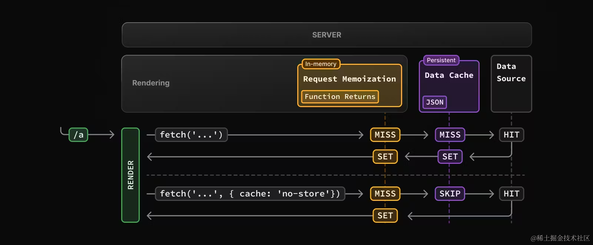

# 缓存篇 | Caching（上）

## Next.js 中有四种缓存机制：
| 机制                        | 缓存内容        | 存储地方        |	目的           | 期间               |
| :---        |    :---    |        :---  |         :---  |         :---  |
| 请求记忆（Request Memoization）| 	函数返回值 | 	服务端 | 	在 React 组件树中复用数据 | 	每个请求的生命周期 | 
| 数据缓存（Data Cache ）| 	数据 | 	服务端	| 跨用户请求和部署复用数据 | 	持久（可重新验证）| 
| 完整路由缓存（Full Route Cache）| 	HTML 和 RSC payload | 	服务端 | 	降低渲染成本、提高性能 | 	持久（可重新验证）| 
| 路由缓存（Router Cache）| 	RSC payload | 	客户端 | 	减少导航时的服务端请求 | 	用户会话或基于时间 | 

## 总结
请求记忆是 React 的数据缓存方案，它只持续在组件树渲染期间，目的是为了避免组件树渲染的时候多次请求同一数据造成的性能影响。

数据缓存是 Next.js 的数据缓存方案，它可以跨部署和请求缓存，缓存数据不会失效，除非重新验证或者主动退出。目的在于优化应用性能。

实际项目开发的时候，请求记忆和数据缓存往往同时存在，共同作用。

